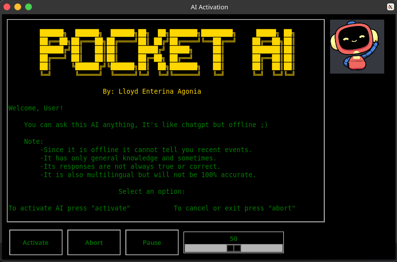

# 🧠 Pocket-AI


A simple **Graphical User Interface (GUI)** for interacting with **Ollama** using **Python**, **Tkinter**, and **Pygame**.  
This project provides an easy way to use locally hosted LLMs through a desktop interface.

---

## 🧰 Requirements
- **Python 3.8+**
- **Tkinter**
- **Pygame**

---

## 🪟 For Windows Users

### 1️⃣ Install Windows Subsystem for Linux (WSL)
Open terminal and run:
```bash
wsl --install
```
After installation completes:
```cmd
wsl
```
Enter a username and password when prompted.

###2️⃣ Install Ollama inside WSL

Once inside your WSL terminal, run:
```cmd
curl -fsSL https://ollama.com/install.sh | sh
```
Then download and start the LLM:
```cmd
ollama run llama3
```
Wait for the model to finish downloading.

### 3️⃣ Run the GUI
After setup, go back to your project directory and run:
```cmd
python main.py
```
# ⚠️ Important Note
All files must be located in the same directory for the program to function correctly.


